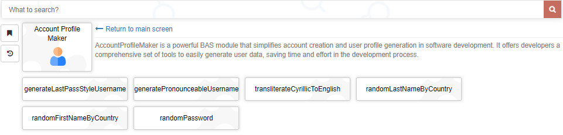
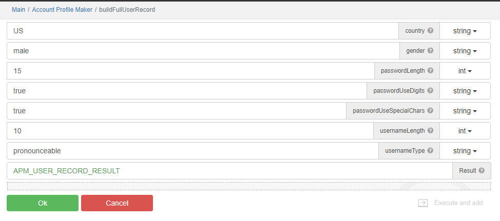
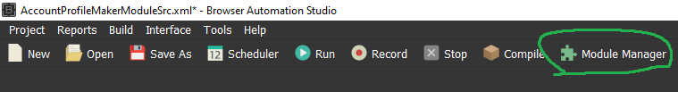
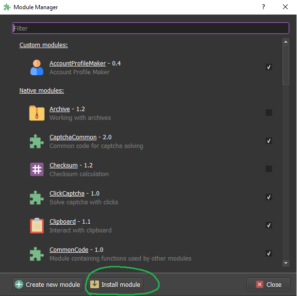
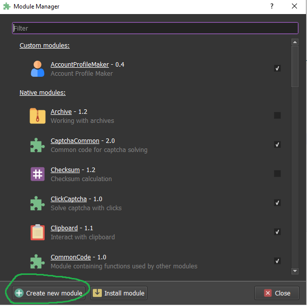
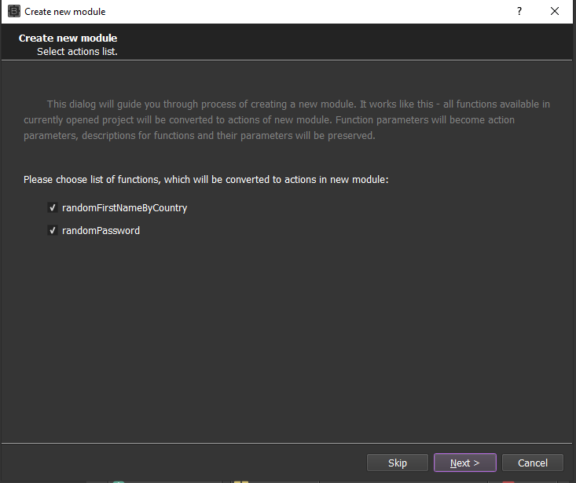

[](https://opensource.org/licenses/MIT)

**Note: This library is currently in active development, and its API may undergo changes without notice at any time.**

## AccountProfileMaker: Simplify Account Creation and User Profiles

### What is a Module in BAS?

In BAS, a `module` is akin to a class in programming languages such as `JavaScript`, `Python`, or `Java`.
It serves as a reusable block of code that encapsulates specific functionality, similar to how classes encapsulate
methods and data in traditional programming languages.

BAS modules offer several advantages:

- **Code Reusability:** Modules allow you to write code once and reuse it across multiple scripts, promoting code
  modularity and simplifying the process of reusing specific functionalities.
- **Organization:** Modules help you maintain a well-organized codebase by grouping related functions and data together,
  just as classes organize methods and attributes.
- **Customization:** You can create modules tailored to your project's needs, focusing on the specific functionality you
  want to reuse.
- **Ease of Integration:** Integrating a module into a script is straightforward, as you only need to import the module
  and use its functions or data.

To create a module:

1. Develop a script containing the functions you want to encapsulate.
2. Create a module from your functions.
3. Install the newly created module in BAS.
4. Incorporate the module into your scripts to access its functionality efficiently.

### What is AccountProfileMaker?

`AccountProfileMaker` is a `BAS` module that simplifies the often complex task of creating user accounts and generating
user data.

It offers developers a comprehensive set of tools to easily generate user data, saving time and effort in the
development process.

### Key Features

- **User Data Generation:** With `AccountProfileMaker`, you can effortlessly generate a wide range of user-related data,
  including usernames, passwords, email addresses, and realistic names.
- **Configurability:** The module offers extensive customization options, allowing you to tailor the generated data to
  match your specific project requirements.
- **Time Efficiency:** Save valuable development time by implementing `AccountProfileMaker`, which automates the process
  of creating user accounts and profiles.

### Screenshots





### TODO:

- [x] randomUsername: Generate random usernames.
- [ ] randomUserData: Generate random user data for profiles, including name, address, phone number(fake),
  email(fake), and more.

### Join the Conversation

`AccountProfileMaker` can make a big difference in your development work, making user account management easier
and more user-friendly. Join in and let's see how this module can help with your projects.

If you have questions, ideas, or success stories, please feel free to share. We're eager to hear from you!

Happy coding!

Other similar projects:

- https://community.bablosoft.com/topic/21385/fakepersongenerator-module-for-creating-a-fake-person
- https://www.npmjs.com/package/@faker-js/faker
- https://www.fakenamegenerator.com/

### Integrating AccountProfileMaker into Your BAS Project:

#### Download the Latest Release:

- Visit the [Releases](https://github.com/sergerdn/bas-modules-account-profile-maker/releases) section of the GitHub
  repository.
- Download the latest release of the `AccountProfileMaker` module by clicking on the desired version.

#### Install the Downloaded Module to BAS:

- Begin by opening your BAS project.
- Access the "Module Manager" tab within the BAS interface.

  

- Locate and click the "Install Module" button.

  

- Next, find and select the downloaded `AccountProfileMaker.zip` module file.
- If you are updating the module, kindly confirm your intent to overwrite the currently installed version when prompted.

You've successfully integrated `AccountProfileMaker` into your BAS project. Now you can use its features to simplify
account creation and user profile generation. Happy automating!

### How to develop BAS module

#### Prerequisites

Before proceeding, make sure you have the following installed on your machine:

- [BAS (Browser Automation Studio)](https://bablosoft.com/shop/BrowserAutomationStudio)
- [make](https://community.chocolatey.org/packages/make)
- [Node.js](https://nodejs.org/en/download)

#### Prepare

- Clone this project to your local machine using the following command:
  ```bash
  git clone git@github.com:sergerdn/bas-modules-account-profile-maker.git 
  ``` 
- Open BAS (Browser Automation Studio).
- Click on "Open" and choose [AccountProfileMakerModuleSrc.xml](bas_scripts/AccountProfileMakerModuleSrc.xml)
- Make the required modifications to the module.
- Save project
- Access the "Module Manager" tab within the BAS interface.

  

- Locate and click the "Create new Module" button:

  

- Proceed with the necessary steps.

  

  

### Pre-Release Module Steps

To prepare for the release, follow these steps:

- Run the following command to copy the contents from the BAS created folder to the project directory and unzip it:
  ```bash
  make copy_and_unzip_build
  ```
- Add/change auto-generated source code
  in [AccountProfileMaker](bas_scripts/modules/compiled/AccountProfileMaker/AccountProfileMaker)
- Run the following command to create a release `AccountProfileMaker.zip` zip file:
  ```bash
  make zip_build
  ```
- **Reinstall the modified module** from [AccountProfileMaker.zip](bas_scripts/modules/compiled/AccountProfileMaker.zip)
  to BAS and perform testing to ensure the changes are functioning correctly.
- Commit your changes and push them to the repository.

#### Running Functional Tests

To run functional tests for the module, follow these steps:

- Ensure you have installed or updated the module via the "Module Manager" tab within the BAS interface.
- Open a new instance of BAS (Browser Automation Studio).
- Click on "Open" and
  select [TestFunctional_AccountProfileMakerModule.xml](bas_scripts/TestFunctional_AccountProfileMakerModule.xml).
- Run the tests.

### How to Make a New Release on GitHub

To create a new release, follow these steps:

1. Ensure you are on the `master` branch. Release creation is only allowed from the `master` branch.
2. Dry run the release process by running the following command:
    ```bash
    make release_dry_run
    ```
3. Edit
   [AccountProfileMaker/manifest.json](bas_scripts/modules/compiled/AccountProfileMaker/AccountProfileMaker/manifest.json)
   and modify the `major_version` and `minor_version` variables according to your future release version.
4. Run the following command to create a release `AccountProfileMaker.zip` zip file:
    ```bash
    make zip_build
    ```
5. Commit your changes with commit message `feat: new version` and push them to the repository with.
6. To create a new release, run the following command:
    ```bash
    make release
    ```
7. Commit your changes with commit message `chore: new version` and push them to the repository with.

You have successfully released your BAS module on GitHub. Please remember to follow any specific release guidelines or
conventions for your project.
