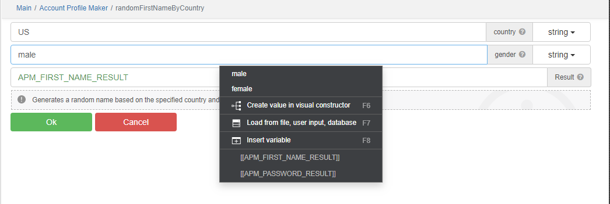

**Note: This library is currently in active development, and its API may undergo changes without notice at any time.**

## AccountProfileMaker: Simplify Account Creation and User Profiles

### What is AccountProfileMaker?

`AccountProfileMaker` is a `BAS` module that simplifies the often complex task of creating user accounts and generating
user data.

It offers developers a comprehensive set of tools to easily generate user data, saving time and effort in the
development process.

### Key Features

- **User Data Generation:** With `AccountProfileMaker`, you can effortlessly generate a wide range of user-related data,
  including usernames, passwords, email addresses, and realistic names.
- **Configurability:** The module offers extensive customization options, allowing you to tailor the generated data to
  match your specific project requirements.
- **Time Efficiency:** Save valuable development time by implementing `AccountProfileMaker`, which automates the process
  of creating user accounts and profiles.

### Screenshots

### TODO:

- [ ] randomUsername: Generate random usernames.
- [ ] randomUserData: Generate random user data for profiles, including name, address, phone number(fake),
  email(fake), and more.

### Join the Conversation

`AccountProfileMaker` can make a big difference in your development work, making user account management easier
and more user-friendly. Join in and let's see how this module can help with your projects.

If you have questions, ideas, or success stories, please feel free to share. We're eager to hear from you!

Happy coding!

Other similar projects:

- https://community.bablosoft.com/topic/21385/fakepersongenerator-module-for-creating-a-fake-person
- https://www.npmjs.com/package/@faker-js/faker
